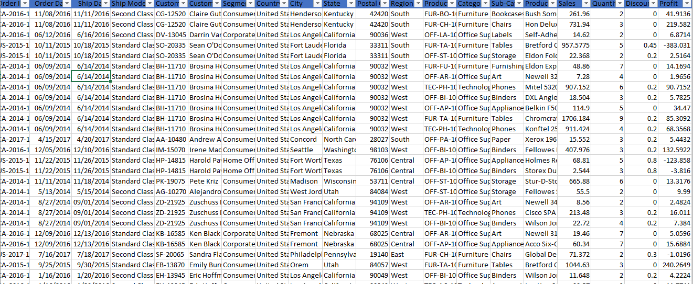
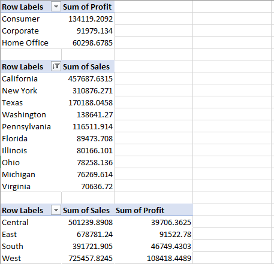
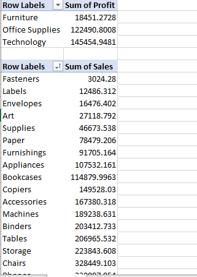
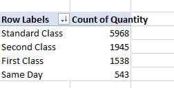
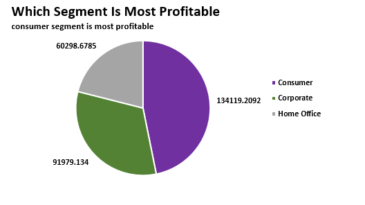
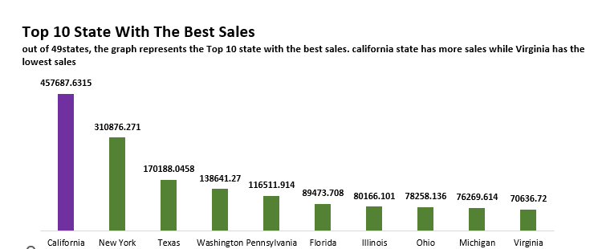
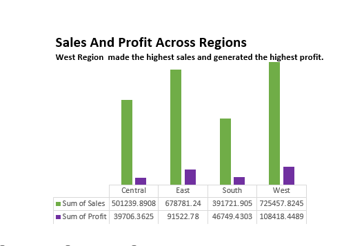
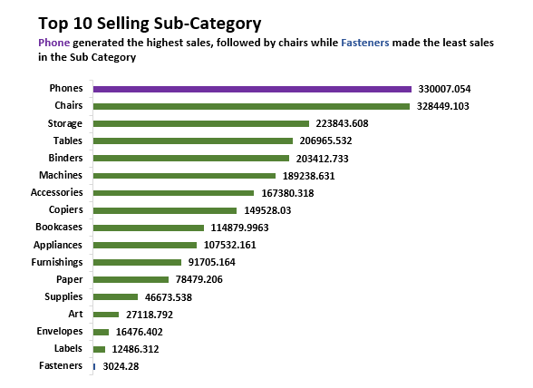
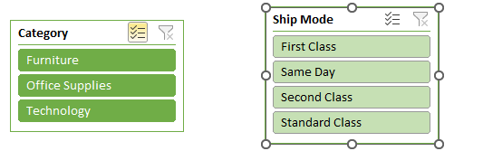

# US-Superstore-Sales-Data

##Business Problem presented by the Manager at U.S Superstore

##Project Requirements

You are to analyze the U.S Superstore Sales Data extensively
Come up with 6 business questions you intend to answer with that data
Clean, analyze and visualize your insights 
Include the following:
Your KPIs (maximum: 4)
Suitable header and subtitles for each visualization
A suitable slicer

##Data

##After given the raw data, i cleaned the data by aligning the data table
checked for any duplicates. part of the task was to come up with 6
Business questions, answer the questions by using pivot table and 
also visualizing the insights.

##Questions

which segment is most profitable
Top 10 state with the best sales
sales and profit Across different regions
which category is most profitable
Top 10 selling sub category
which shipping mode with the highest quantity requested

##Pivot Table

##Visualisation

Consumer segment is the most profitable out of the 3 segments. it is
likely for a business manager to invest more in the consumer segment

##answer 2 

Given 49 state in the data. the graph shows an insights of the Top
10 state with the best Sales.
California has the highest sales and Virgina has the least sales.
A business owner would prefer moving to california due to the turnout
of sales

##Question 3

The chart shows the sales and profit across Regions(West,East,Central,South)
West region has the made the highest sales and generated the highest profit,
South region made the least sales but did not generate the least profit.

##Question 4

phones being the highest selling Sub-category generated 330007, 
followed by chairs with 328449.
## slicer

Slicer showing shipping mode and category

